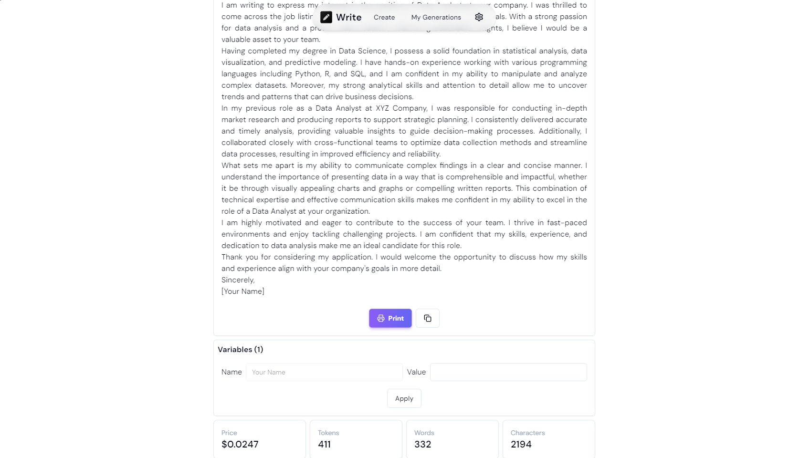

The next major iteration of Synapsy Write is now available for everyone. This version introduces a new UI for mobile devices and new features. Let's dive in!

## Redesigned User Interface

One of the most noticeable changes in the new UI is the new nav bar for mobile devices. The nav bar has two buttons: My Generations and Settings, with the Create button in the middle. The My Generations button allows you to access and manage all your previous and current generations. The Create button is the main feature of Synapsy Write, where you can start a new generation by entering a prompt, a title, a genre, or a keyword.

Another change in the new UI is the addition of new headers for each section of the app. The headers provide a clear and concise overview of what each section is about, and help you navigate through the app with ease.

The new UI also features several components that have been redesigned to make them more user-friendly and aesthetically pleasing.

## Settings page

Another feature that we have added to Synapsy Write is the new settings page, where you can set your API Key and retrieve the available OpenAI models. The settings page is accessible from the nav bar on the mobile devices, or from the menu on the top right corner on the desktop devices.

The API Key is a unique identifier that allows you to use Synapsy Write and access the OpenAI models. To get your API Key, you need to sign up for an account on OpenAI's website, and then copy and paste the API Key into the settings page. The API Key is required for every generation, and it ensures that your data is secure and private.

You can also set the language and the theme of the app to fully customize your experience.

## Variable auto-detection

We also added the possibility to automatically detect the presence of placeholder text in your generations. For instance, if the AI generates a text like this `"Sincerely yours, [Your Name]"`, you will now be able to set an actual value for the variable `[Your Name]`. Thanks to this feature, you can reuse a generation by adjusting the values you need.

## Changelog

### New

- Added new headers
- Added locales for Settings page
- Added settings page
- Added new settings button in navbar
- Added models section in settings
- Added new navbar
- Added manifest
- Added the possibility to install the app as a PWA
- Added search in history
- Added new hover effects on nav bar
- Added new card design
- Added shadow when scrolling
- Added variable auto-detection
- Added new input style
- Added About section
- Added the possibility to display the API Key

### Fixed

- Fixed language switcher issues
- Fixed an issue with models
- Fixed json file issue
- Fixed index issue
- Fixed alignment issue on mobile
- Fixed an issue in print mode
- Fixed alignment issue in settings
- Fixed color inconsistency
- Fixed alignment issue in My Generations

### Updated

- Improved alignment
- Improved welcome UI
- Improved hover effects
- Improved Slider's design
- Improved View Generation page
- Made header sticky on mobile devices
- Improved borders in Create page
- Update app manifest with screenshots
- _Updated dependencies_

## Launch

[Click here](https://write.peyronnet.group) to launch the app.
